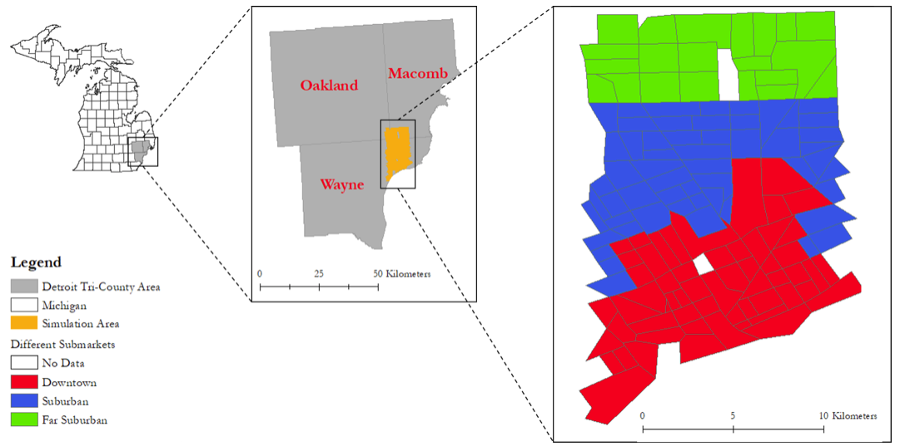

# Utilizing Agents to Explore Urban Shrinkage: A Case Study of Detroit

Copy of the code and ODD oringally uploaded to <https://www.comses.net/codebase-release/d16c227c-0e0e-4909-9fae-8470bb675905/>
 
## Reference
 
* **Jiang, N. and Crooks, A.T. (2020)**, Utilizing Agents to Explore Urban Shrinkage: A Case Study of Detroit, *2020 Spring Simulation Conference (SpringSim’20)*, Fairfax, VA.

## Abstract from the Paper:

"While the world’s total urban population continues to grow, this growth is not equal. Some cities are declining, resulting in urban shrinkage which is now a global phenomenon. Many problems emerge due to urban shrinkage including population loss, economic depression, vacant properties and the contraction of housing markets. To explore this issue, this paper presents an agent-based model stylized on spatially explicit data of Detroit Tri-county area, an area witnessing urban shrinkage. Specifically, the model examines how micro-level housing trades impact urban shrinkage by capturing interactions between sellers and buyers within different sub-housing markets. The stylized model results highlight not only how we can simulate housing transactions but the aggregate market conditions relating to urban shrinkage (i.e., the contraction of housing markets). To this end, the paper demonstrates the potential of simulation to explore urban shrinkage and potentially offers a means to test polices to alleviate this issue."

**Keywords**: Urban Shrinkage, Housing Markets, Detroit, Agent-based Modeling, GIS 
 
 
 

## Example Simulation Run

Click on Image to see a simulation run. 

## Whats in this Repository? 
* [NetLogo Code and Data](UrbanShrinkage.nlogo)
* [Overview, Design concepts, and Details (ODD) Document](Shrinkage_ODD.pdf)

## What is Needed to Run the Model?
NetLogo Version 6.1.0
